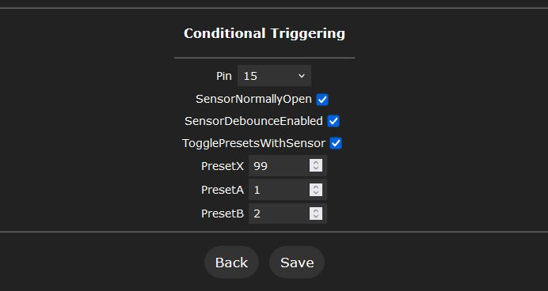

# Conditional Triggering Usermod

---

### Author
[Adam Matthews](https://github.com/adamsthws)

---


### Description

This usermod allows dynamic control of presets based on the state of a connected sensor or switch.
If the sensor is in an ON state, preset A is activated. Conversely, if the sensor is in an OFF state, preset B is activated.
This is ideal for creating a responsive setup that changes based on environmental inputs or physical interactions.


---

### Example Usage

- **Light Sensor**:  
  Use a light sensor to trigger a calm effect during nighttime or an energetic effect during daytime.

- **Liquid Level**:  
  Use a liquid level sensor to trigger a red effect when a water tank is empty or a green effect otherwise.

- **Trigger Relays**:  
  Combine it with the 'multi_relay' usermod. e.g. If water tank has liquid, turn on water-pump (PresetA), otherwise start flashing red warning lights (PresetB).


---

### How to use

- **Triggering mode**: 
When you activate the 'triggering' preset, the sensor's state is first evaluated, then another preset is activated (either preset A or preset B), depending on whether the sensor is open or closed.

- **Auto-toggle mode**: 
Automatic switching between Preset A and Preset B based on changes in the sensor's state. If Preset A or B is currently active and the sensor state changes, the system will automatically switch to the other preset.


---

### Create the 'triggering' preset


- Add a new preset

- Set the preset ID to: **99**

- Untick 'Use current state'

- Add the following 'do nothing' API command: **&NN**


---

### Configurable options

Find these in the user interface, under "Settings" > "Usermods".



- **Sensor Pin**: Set the GPIO pin that your sensor/switch is connected to.

- **Sensor Type**: Choose between "Normally Open" or "Normally Closed" sensor/switch type.

- **Sensor Debounce**: Enable or disable debouncing for the sensor/switch. (Cleans up noisy sensor/switch signals).

- **Auto-Toggle Presets With Sensor** - If the sensor state changes while Preset A or Preset B is active, it will switch to the other preset.

- **Preset X**: Triggering preset - Set the preset ID that, when activated, will check the sensor state and then trigger either Preset A or B accordingly.

- **Preset A**: Set the preset ID that will be activated by the Triggering Preset when the sensor is in the ON state.

- **Preset B**: Set the preset ID that will be activated by the Triggering Preset when the sensor is in the OFF state.

---

### Installation

To enable this usermod, within 'platformio.ini' or 'platformio_override.ini', add the following new line under "build_flags =" for your board:
```
-D USERMOD_CONDITIONAL_TRIGGERING
```
